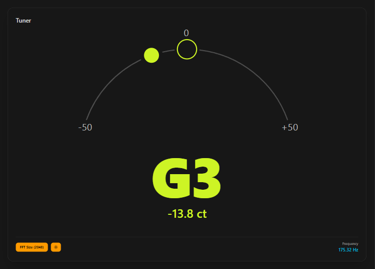
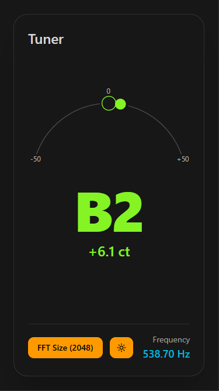

# Tuner
This is a generic tuner app that can tune guitars, ukuleles, and other instruments. It works well for most notes, but may have problems detecting lower-pitched notes or very quiet notes.

	
	

## Features
- Can be installed as a Progressive Web App (PWA) on your mobile phone for easy access.
- Toggle for different FFT sizes for better audio detection (larger sizes are more accurate but slower).
- Toggle for light and dark mode.

## Development Notes
- UI generated by ChatGPT, inspired by Ableton Live's tuner.
- Components generated via v0.
- The tuning logic was implemented with help from [this YouTube video](https://www.youtube.com/watch?v=x4qAFnFQRRg).
- App icon made by [W314a](https://github.com/W314a).
